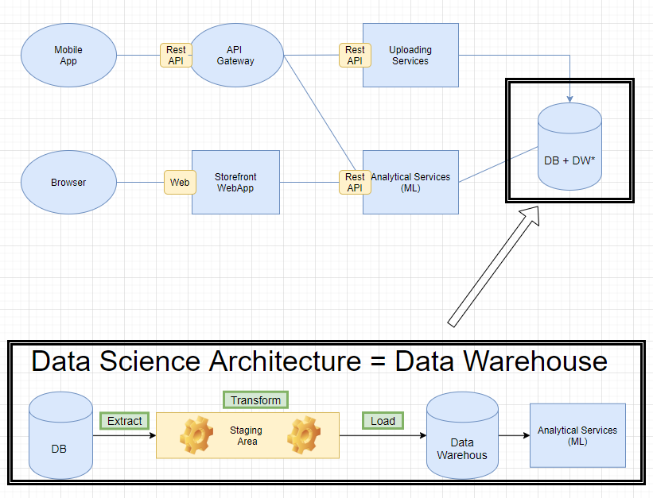

## Welche Art von Data-Science Architektur würde für Ihr Projekt passen? Und Wie könnte diese aussehen?

Für unseren Projekt würden wir uns für die herkömmliche Architektur von Data Warehouse wahrscheinlich entscheiden. Die Daten, die uns zur Verfügung stehen (die Uploads von den Bank-Files) haben eine tabellarische Struktur und deshalb wird unser DB ein relationales Datenbank sein, dass natürlich entsprechend modelliert sein muss und gegeben Falls normalisiert so dass man mit mehreren Tabellen arbeiten wird. Man kann sich aber  die Daten, die in diesem DB gespeichert werden als eine Tabelle wo man in der ersten Spalte den Kunden-Id findet und die weiteren Spalten mit Kundencharakteristika und mit 1000 von Spalten für verschiedene Ausgabearten und Bankcharakteristika. Wie gesagt die Daten werden natürlich in mehreren Tabellen die entsprechend normalisiert wurden gespeichert werden.  

Von diesem Datenbank werden die daten mit ETL-Prozedere extrahiert in Staging Area entsprechend umgeformt, so dass man sie direkt für das trainieren von ML benutzen kann oder werden entsprechend voraggregiert, so dass man daraus schnelle deskriptive Statistiken erstellen kann und das ganze schnell in dem Dashboard visualisieren kann.  

Diese Architektur wurde in der obigen Abbildung in dem unteren Teil dargestellt. Man sieht dort ganz übersichtlich, wie das Datawarehouse an unseren ursprünglichen Architekturentwurf hinzugefügt wurde.

## Warum nicht ein anderer Ansatz?

Es gibt sicher viele Möglichkeiten eine andere Architektur zu wählen, um die gewünschten Resultate zu erzielen. Wir haben uns für den Datawarehouse entschieden, weil für die Daten, die wir für unser Produkt benutzen es sich sicher eignet und man so die gestellten Anforderungen erfüllen kann. 

## Wie könnten Pipelines Verwendung finden?

Wir glauben, dass man in erstem Schritt für unseren Projekt die Pipeline so anwenden könnte, dass nach dem ein Kunde seine Daten  uploadet hat die ETL-Schritte automatisch erfolgen.  

Im nächsten Schritt könnte man eine Pipeline bauen, die das Training von ML-Modellen automatisch zwei Mal monatlich startet, so dass der Kunde immer zugriff auf Resultate von aktuell trainierten Modellen zur Verfügung hat.  

Man könnte sich in einer weiteren Zukunft auch einen upgrade in der Anwendung vorstellen, so dass man Schnittstellen zu den populärsten Banken erstellt und die Daten, die der Kunde selber uploaden müsste täglich in der Nacht automatisch gezogen werden (solange neue Transaktionen) und somit hätten wir ein Pipeline von Data-Loading bis zum Output von trainierten ML-Modellen.

