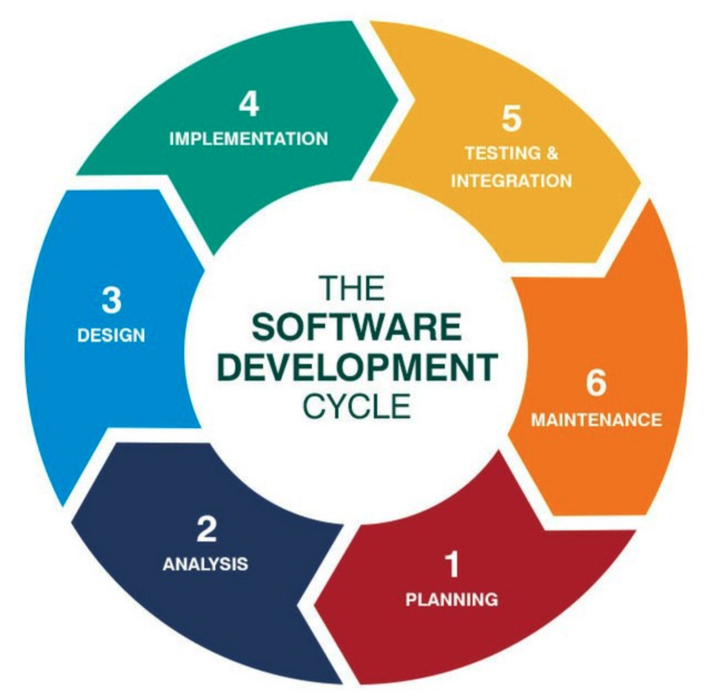

# Cost Analyser Application -- Software Design

[TOC]

## Development Model

We will use as development waterfall model the development cycle to improve and ensure software quality. Following image will show the phases of the model:

**1. Planning**
This phase will define the main goal of the development:

- Setting a goal
- Planning a budget
- Finding the right resources to begin (developers, materials)
- Scheduling

This phase in the cycle will require a lot of communication between the development and the stakeholder(s).

**2. Requirements /Analysis**
This is one of the most most important steps in the cycle. The project management team must communicate with the development team. The project management team gets  the requirements from the stakeholders. State of the art is an agile development modus.. Agile methods like Design Thinking may produce a backlog of tasks to be performed.

**3. Design**
After the requirements are discussed, agreed upon and understood the next step is for the architects of the project. The design phase requires consistency, this is why developers use frameworks! Developers will use design patterns to solve algorithmic problems. The design phase should be documented so the developers know exactly what design patterns they want to use, and where they want to use them.

**4. Implementation**
This phase produces the software. Agile development is very helpful because it helps organize development goals in a timely manner using "**Sprints**".  The project management team or the product owner should be heavily involved with this phase to ensure all expectations are met by the development team.

**5. Testing**
One of the most  important steps in the lifecycle of software development. This phase ensures that you know if your software is of quality to deploy. Testing will help measure a number of things:
- Code quality
- Unit testing (functional tests)
- Integration testing
- Performance testing
- Security testing

**6. Deployment**
We will using pipelines to automate deploy the software as soon as an issue is closed (feature deployment). This will give all of the users the “finished” product until bugs are found which leads us to our next phase.

**7. Maintenance**
Bugs will be the biggest issue in this phase. Users will report them and it is up to the development team to fix anything that is lowering the functionality of the software. For new features we will start again with step/phase 1.

## System architecture
More information about the system you can find on the document [Cost Analyser Application -- System and software Architecture ](../Architecture/Cost Analyser Application - System and Software Architecture.md) and for Data Science in the document [Cost Analyser Application -- Data Science Architecture ](../Architecture/Data_Science_Architektur.md)

## Design Patterns

Following design patterns will be used in our software:

### Command Pattern

**Command** is a behavioral design pattern that turns a request into a stand-alone object that contains all information about the request. This transformation lets you parameterize methods with different requests, delay or queue a request’s execution, and support undoable operations.

**Transactional behavior:** Database engine or csv upload process may keep a list of operations that have been or will be performed. If one of them fails, all others can be reversed or discarded (usually called *rollback*). For example, if two database tables that refer to each other must be updated, and the second update fails, the transaction can be rolled back, so that the first table does not now contain an invalid reference.

**GUI buttons and menu items:** In the ability to perform the desired command, an "Action" may have an associated icon, keyboard shortcut, tooltip text, and so on. A toolbar button or menu item component may be completely initialized using only the Action object.

### Bridge Pattern

- An abstraction and its implementation should be defined and extended independently from each other.
- A compile-time binding between an abstraction and its implementation should be avoided so that an implementation can be selected at run-time.

For defining the mapping of our bank accounts it is necessary to have an "Abstraction" of a standard bank account to its "Implementors" like Hypo or Volksbank

### Decorator Pattern

The decorator pattern can be used to extend (decorate) the functionality of a certain object statically, or in some cases at run-time, independently of other instances of the same class, provided some groundwork is done at design time. This is achieved by designing a new *Decorator* class that wraps the original class. 

In the Cost Analyser Application we will use the Decorator Pattern also in the implementation of bank accounts and for logging within our functions.

## API

An API is the base of all the apps that deal with data or enable communication between two products or services. We will empower our apps and UIs to other mobile application or platform to share its data with our or their apps/platforms. It will ease the user experience without involving the developers. 

In the future, we want to provide our service also to other tools to integrate it. 

### Main features of our API:

- **Search by criteria**: The API will let the users search data based on different criteria, like a date or shop name. 
- **Paging**: Many times, it happens that we do not want to see the complete data changed, but just a glimpse of it. In such a scenario, the API should be capable of determining how much data to display in one go and at what frequency. It should also inform the user about the no. of pages of data remaining.
- **Sorting**: To ensure that the user receives all the pages of data one-by-one, the API should empower the users to sort data as per the time of modification or some other condition.
- **JSON Support/ REST**: The REST APIs are stateless, light-weighted and let you retry the upload mobile app process if it fails. Besides, JSON’s syntax resembles that of most of the programming languages, which make it easy for a mobile app developer to parse it into any other language.
- **Authorization via OAuth**: It is again necessary that your API authorizes via OAuth since it is faster than other methods – you just need to click on a button and it’s done.
- **Use Throttling**: App Throttling is needed for redirecting overflow of traffic, backup APIs and safeguarding it from DoS (Denial of Service) attacks.

### HTTP Errors

Our API must be able to handle all kind of requests and return errors in as descriptive and standard form. The following are the default HTTP error codes we will use:

- 200 - Generic everything is OK.
- 201 - Created something OK.
- 202 - Accepted but is being processed a sync (power off, provisioning, etc.).
- 400 - Bad Request (invalid syntax).
- 401 - Unauthorized (no current user and there should be).
- 403 - The current user is forbidden from accessing this data.
- 404 - That URL is not a valid route, or the item resource does not exist.
- 410 – Data is deleted or doesn’t exist.
- 405 - Method Not Allowed (calling post method when only get is allowed, etc.).
- 500 – API internal error.
- 503 - System is in maintenance mode.

### API Endpoints:

| **Method** | **Description**                                    | Usage                                         |
| ---------- | -------------------------------------------------- | --------------------------------------------- |
| GET        | Used to retrieve a representation of a resource.   | GET stored data by date, shop                 |
| POST       | Used to create new new resources and sub-resources | POST new CSV file to upload a new bank export |
| PUT        | Used to update existing resources                  | PUT to update an already uploaded bank export |
| PATCH      | Used to update existing resources                  |                                               |
| DELETE     | Used to delete existing resources                  | Delete one or more entries                    |

## Testing

### Characteristics of a Banking Application

Before we begin testing, it's important to note the standard features expected of any banking/finance application. A standard banking application should meet all these characteristics as mentioned below. 

- Support thousands of concurrent user sessions
- Integration with numerous bank accounts
- Process fast and secure
- Include massive storage system.
- To troubleshoot customer issues, it should have high auditing/logging capability
- Support users on multiple platforms (Mac, Linux, Unix, Windows, mobile devices)
- Support users from multiple locations
- Support multi-lingual users
- Support multiple service sectors (Loans, Retail banking etc.)
- Foolproof disaster management mechanism

### Test Phases

**Requirement Review:** Quality analysts, PO, and development leads are involved in this task. The requirements document is reviewed and cross-checked to ensure that it does not affect the workflow

**Database Testing:** Important part of our finance application testing. This testing is done to ensure data integrity, data loading, data migration, stored procedures, and functions validation, rules testing, etc.

**Integration Testing:** Test that all components that are developed are integrated and validated

**Functional Testing:** The usual software testing activities like Test Cases. A Test Case will review and test an execution and is done during this phase

**Security Testing:** It ensures that the software does not have any security flaws. During test preparation, QA team needs to include both negative as well as positive test scenarios so as to break into the system and report it before any unauthorized individual access it. For Security Testing, automation tools are used while for Manual Testing tools like Proxy Sniffer, Paros proxy, HTTP watch, etc. are used

**Usability Testing:** It ensures that different people will be able to use the system as normal user and don't affect the other users performance or stability. 

**User Acceptance Testing:** It is the final stage of testing done by the end users to ensure the compliance of the application with the real world scenario.

### Sample Test Cases

#### Admin Test Cases:

	- Verify Admin login with valid and Invalid data
	- Verify admin login without data
	- Verify all admin home links
	- Verify admin change password with valid and invalid data
	- Verify admin change password without data
	- Verify admin change password with existing data
	- Verify admin logout

#### For Users:

	- Verify all links
	- Verify customers login with valid and invalid data
	- Verify customers login without data
	- Verify csv upload with and without data
	- Verify csv upload with valid or invalid data

### For new Users

	- Create a new user with valid and invalid data
	- Create a new user without data
	- Verify cancel and reset option
	- Update user with valid and invalid data
	- Update user with existing data
	- Verify cancel option
	- Verify deletion of the user

