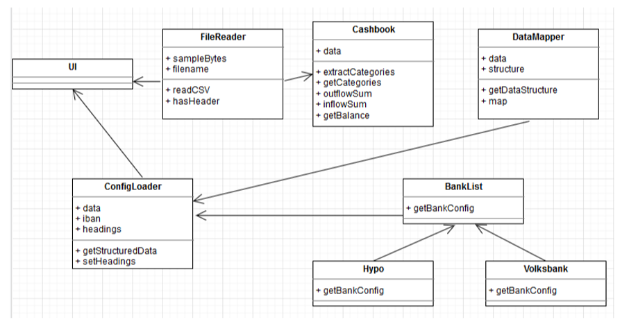

# Cost Analyser Application -- Requirements Evolution

[TOC]

## Improving UML Diagram

I believe our FileReader class should be extended so that it will be able to read different format and not only accepting CSV, or we can create 1 class for for just identifying which format the user is uploading. What do you think?

