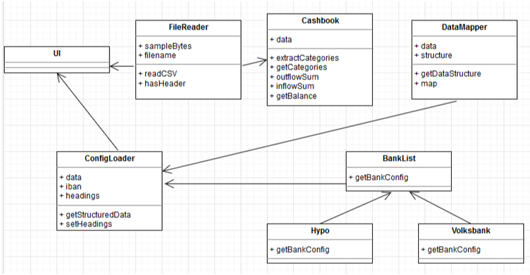

# Cost Analyser Application -- Requirements Engineering

[TOC]

## Business Goals of the Software

The Cost Analyser application is able to help user track his bank account's expenditures and receivables. A user will get an overview of all his expenses over several bank accounts by uploading his CSV exports. The CSV exports are downloaded from his bank accounts. The tool is able to show a dashboard with an overview of all the clustered categories (or an individual category). The user is able to filter by date and categories.

Figure 1: Draft of the dashboard shows a first PoC of the dashboard. Every user could have several bank accounts. As an example, the dashboard shows an account from Hypotirol, Sparkasse and Anglo Austrian Bank. Every bank account on the application shows a summary of the expenditure, receivables and balance through a line graph (line graph shows only last 3 to 6 months). However, if the user will click either button expenditure, receivable, the user has the chance to see a daily, monthly and yearly overview. And the graph next to it shows the cluster of categories (for expenditure for example: shelter, food, clothing, USAW). The very left graph shows the user's total balance of all his bank accounts. 

Figure 1: Sample Dashboard

## Main Requirements

### LOG-IN SCREEN
-   The user should register himself in the system registration screen before he can use it, this for security reasons. The username has to be an email address and the password should be secure enough since the data is very sensitive. Password must be at least 12 characters and must contain at least one capital leter, one number and one symbol.

-   In the registration process the user must give a recovery email as well as a question with an answer in order to be able to recover username or password. Optionally the user is able to add a phone number to setup a multifactor authentication with TAN codes.

-   The user will have to login every time he wants to use the system (username and password).

-   If the user forgets his username and/or password, there should be a button or link for the user to recover them. In this new recovery window, the user will give either the recovery e-mail or the phone number he gave for recovering when registering. The system will send a link to the recovery email for reseting username and password. When the user click on the link in the email, he will be redirected to a window where he will be able to select a new password. The username will be already filled-in in the field username.

-   After the first time of login, the system will guide the user to upload his first CSV file. Hints for exporting and uploading the data will be given in form of pop-up windows or will be opened as instructions in an extra window or with a video which will need to be started by the user.

### LOG-IN SCREEN -- Possible changes

-   Prepare the system to log-in with best-sign technology, that means, the access should be confirmed from another confirmed device thru fingerprint.

-   The system will accept other formats of documents such as xls, xlsx and others to come. For this reason, the uploading instructions must be adapted to the new comers. 

### HOME SCREEN -- Main Dashboard
Like shown in Figure 1: Draft of the dashboard, a dashboard with following charts will be shown:

-   Balance of all accounts the customer have.

-   The user should be able to select/filter which banks he/she wants to get shown.

-   Overview per bank account with all receivables, expenditures and balance from the last 3 months. This can be changed and extended till 1 year.

-   There should be 3 buttons to decide what should be shown, receivables, expenditures or just the balance instead of the three together.

-   For the expenditures, there should be a graph where the user can see (clustered) for which classes he/she has spent how much money.

-   The user should have the option to save his preferences. For example, he/she should be able to select which banks, which information he want to become shown everytime he/she is logging-in. This should be a "standard layout". Each layout must be saved with a name. These layouts should be just shown to the owner.

-   The amount of allowed layouts should be unlimited.

-   Layout preferences must be saved in order to be able to suggest the user standard layouts.

-   The name of the layout should be no longer than 30 characters. This information should be shown to the user in a help information window to the field.

-   The user shall be able to export the dashboards as a standardized CSV or Excel report.

### HOME SCREEN -- Possible changes
-   New banks logos and CSV documents will be included in the software.

-   The system must be able to show more dashboards which could be added in the future.

-   The classes of the expenditures will be adapting themselves as more data will be collected.

-   The system will be offering different standard layout according to the preferences of the customers.

-   The system will be showing as well the summarized data in form of a table which will be exportable in CSV or Excel as well.

### SECURITY
-   The user should be able to be logged-in just once. The system should deny other attempts to log-in a user which is already logged-in.

-   The user should get a notification per E-Mail if his/her user was used at the moment he/she was already logged-in in the system.

-   After 10 minutes of inactivity, the user should be asked if he/she wants to remain online. This question should be confirmed with a button "Yes, I want to remain online". If the question is not answered in 1 minute, the system must logout the user.

### SECURITY -- Possible changes

-   The system should work as well in other countries.

-   The system will need to be adapted to new security rules for banking software.

### HELP MENU
-   There should be a FAQ section. 

-   In this section, the user will be able to search for the topic of his/her interest with the use of help-words. The search must not be case sensitive.

-   In this menu, there should be one or more csv model documents that can give an idea to the user what kind of csv documents the system can work with.

### HELP MENU -- Posible changes

-   The FAQ section will be expanded constantly according to the needs of the users.

-   The system will accept other formats in the future. There must be as well model documents from these other formats.

-   There will be a contact formular in this section to receive questions not found in the FAQ.

-   The system will use the given text in the search field by the users and will look automatically this text in the available contents in the FAQ and will suggest these questions to the user.

## GENERAL FUNCTIONALITIES
-   The user should be able to log-out with just 2 clicks, no mattering where he/she is at the moment in the system. The log-out button should be confirmed with a warning window "Are you sure you want to log-out\" or "Finnish session"? This needs to be confirmed or denied. This will avoid that the user will be logged-out unvoluntarily in case he clicked by mistake.

-   The dashboard should be as big as the browser. That means, if the user changes the size with the help of the keys "Strg" + "+" or "-", the dashboard shown, included all information there should adapt to this new size.

-   The system should be available in English and German.

-   The system shall work on all main browsers. The system will be available in the internet browsers of the devices.

-   The system shall work on several devices like big/small screens and iOs and Android devices.

-   The system will map all uploaded CSV files to a standard model of the system.

-   The user is able to upload files easily with a button "Search file". This will open the windows explorer and a file will be able to be selected.

-   The system should recognize which browser it is being opened with, and if it is not a supported browser, it should tell the user which browsers are supported.

## GENERAL FUNCTIONALITIES -- Possible changes

-   The system will be adapted to new internet browsers versions.

-   The system should be expandible to read more formats and not just CSV.

-   The system will save the information of the opened browser which was not supported in order to adapt it to these new internet browsers.

-   The system will be adapted to new operating systems if needed.

-   The system will be extendible to other languages.

## NOT FUNCTIONAL ATTRIBUTES (SYSTEM PERFORMANCE)

-   The system should be able to show the Home-Screen dashboard after log-in in maximum 2 seconds for the average user session.

-   When the user will change the actual displayed information, this changes should be shown in within a couple of seconds.

-   The response time for a filter request may have no longer duration than 2 seconds for an average user session.

## CONNECTION ISSUES

-   If the server would be not reachable, the system will show the user exactly this information on the screen, that the server at the moment is not available. The text to show should suggest as well to use F5 to refresh the shown information. This way, the user can understand why he is not becoming any information shown.

## SOFTWARE ISSUES

-   If the software has problems with loading the csv documents because of its format, the user should be informed about it. "The CSV document can't be read, please revise it and try again. Check as well in the FAQ section for possible solutions". 

-   In case of failure by uploading, the system will suggest the user to check on the standard files accepted. Links for these files will be shown right under the failure text. 

-   The user shall also have the possibility of requesting a new standard file from (maybe) a new bank (which is currently not supported by the system). As well, together with the failure text, there should be a link for requesting a new standard file. The link should redirect to a list with supported banks. If the user doesn't find the desired bank in the list, there should be the option to upload a new CSV file.

-   The system will send a confirmation if the file was uploaded correctly or a failure message instead.

## SOFTWARE ISSUES -- Possible changes

-   The system will generate a log file when failure will be detected and this will be ready to be sent to the development team per e-mail. For that, the user needs to have the chance to accept that this information will be sent. A failure window should be opened as well in which the user can accept with an "ok".

-   The system will open a window for selecting the right columns to use. The system will try to recognize which columns are needed and will suggest these to the user. Not recognized columns will be selected by the user manually. If possible, the system will try to change the format of the columns when possible. If a data column is missing, the user will know what is the problem with his file.

## THE DATA

-   The data which will be saved in our DB, must be able to be exported anonym to banks for example in order to perform machine learning analysis.

## Model the central elements using suitable UML diagrams

At present, here is the idea of the application design through an UML diagram.

-   The application reads the bank account CSV file specified in the FileReader Class

-   Then it loads config of bank CSV file based on the IBAN

-   It maps CSV fields to general data format for later use

-   Finally, it calculates balance based on expenditure/receivable transactions

*To do: We can maybe add Dashboard Class if you like the idea of having a dashboard. A class for Clustering based machine learning algorithm.*

Figure 2: UML diagram
